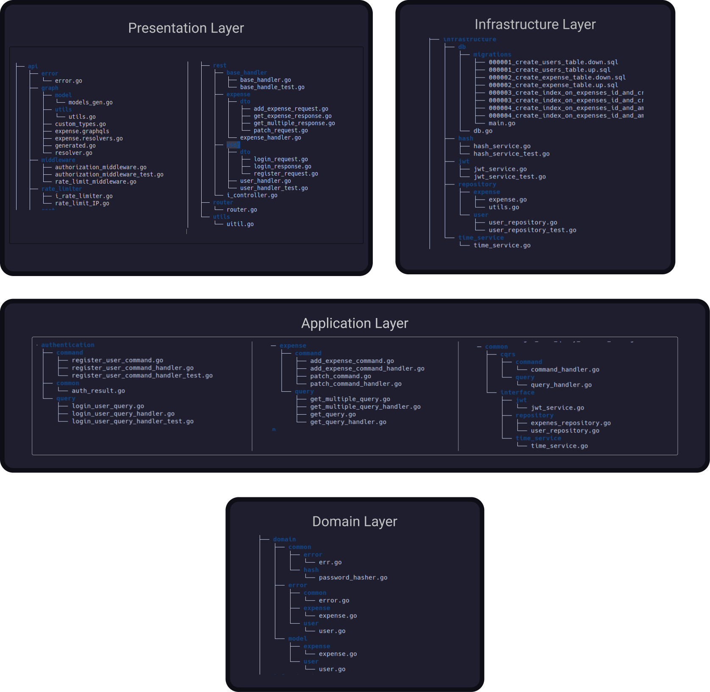

# Go Backend Clean Architecture (Financial Tracker)

This is a back-end for a Financial Tracker app, built to learn GraphQL, Clean Architecture and Domain-Driven Design using vanilla Go. Feel free to use this project as a template for your own Go backend projects.

I appreciate any feedback on the project; it helps everyone, especially me.

## Technologies

- Go
- Postgres
- Docker
- gqlgen

## About Me

Hi, I’m Beka Birhanu. I’m currently part of the A2SV training program and work with Clean Architecture on a daily basis.

### How to Run This Project

You can run this Go Backend Clean Architecture project with or without Docker. Here’s how to do both:

- **Clone the project**

```bash
# Move to your workspace
cd your-workspace

# Clone this project into your workspace
git clone https://github.com/beka-birhanu/finance-go.git

# Move to the project root directory
cd finance-go
```

#### Run Without Docker

1. Install Go and Postgres if not already installed on your machine.
2. Edit a `.env` with your configuration.
3. Run `go mod tidy`.
4. Run `make run`.
5. Access the API at `http://localhost:8080`.

#### Run With Docker

1. Install Docker and Docker Compose.
2. Run `docker-compose up -d`.
3. Access the API at `http://localhost:8080`.

### How to Run Tests

```bash
# Run all tests
make test
```

## File Structure



### API Documentation

[RESTful APIs docs](./docs/API_DEFINITION.md)
[GraphQL APIs docs](./docs/GRAPH_API_SCHEMA.md)

### TODO

- Improve based on feedback.
- Add more test cases.
- Collect mocks into a dedicated directory.

If this project helps you in any way, show your support ❤️ by starring this project ✌️

### License

```
MIT License

Copyright (c) 2024 Beka Birhanu

Permission is hereby granted, free of charge, to any person obtaining a copy
of this software and associated documentation files (the "Software"), to deal
in the Software without restriction, including without limitation the rights
to use, copy, modify, merge, publish, distribute, sublicense, and/or sell
copies of the Software, and to permit persons to whom the Software is
furnished to do so, subject to the following conditions:

The above copyright notice and this permission notice shall be included in all
copies or substantial portions of the Software.

THE SOFTWARE IS PROVIDED "AS IS", WITHOUT WARRANTY OF ANY KIND, EXPRESS OR
IMPLIED, INCLUDING BUT NOT LIMITED TO THE WARRANTIES OF MERCHANTABILITY,
FITNESS FOR A PARTICULAR PURPOSE AND NONINFRINGEMENT. IN NO EVENT SHALL THE
AUTHORS OR COPYRIGHT HOLDERS BE LIABLE FOR ANY CLAIM, DAMAGES OR OTHER
LIABILITY, WHETHER IN AN ACTION OF CONTRACT, TORT OR OTHERWISE, ARISING FROM,
OUT OF OR IN CONNECTION WITH THE SOFTWARE OR THE USE OR OTHER DEALINGS IN THE
SOFTWARE.
```

### Contributing to Finance-Go

All pull requests are welcome.
